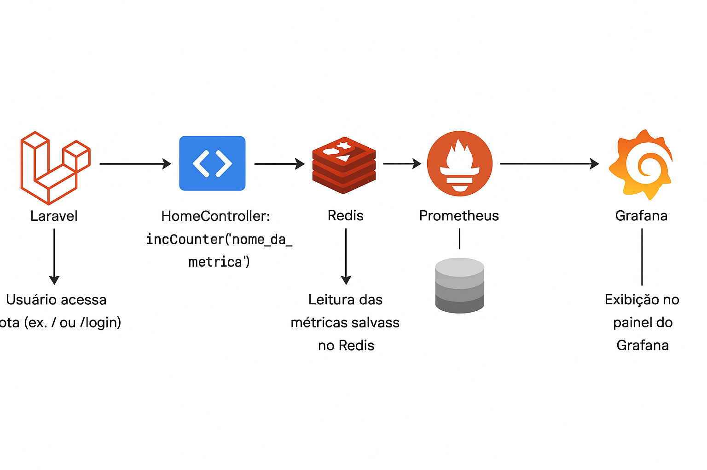
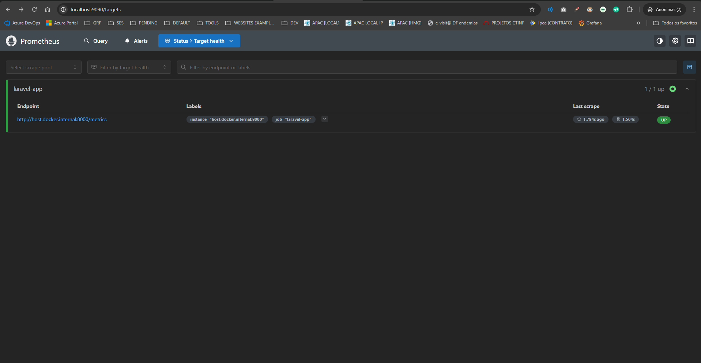
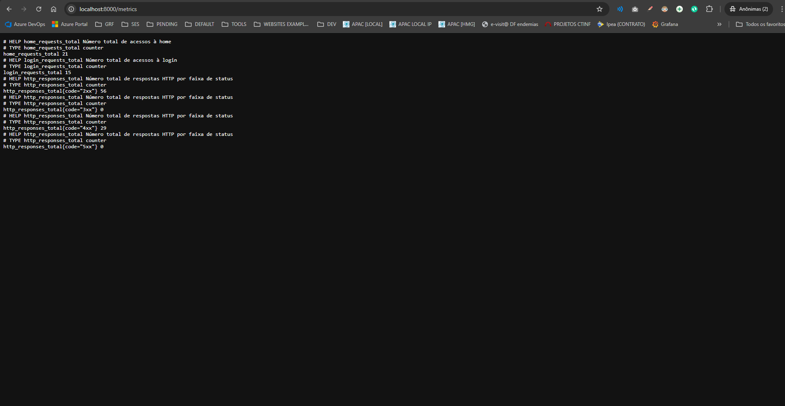
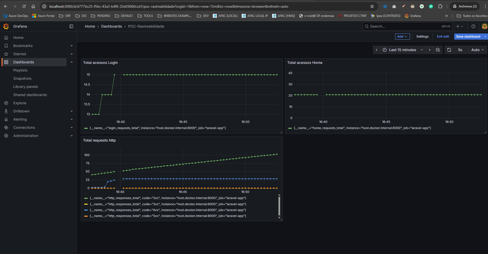
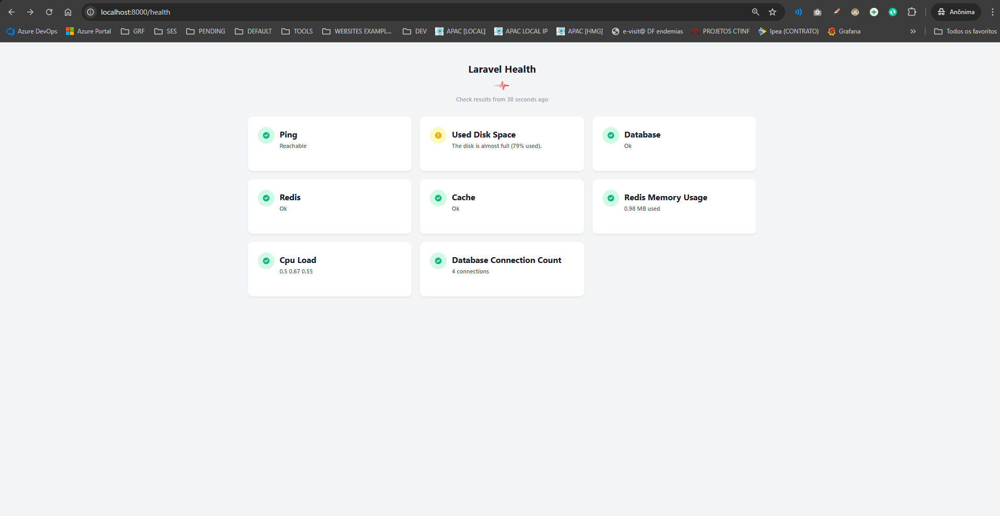

# Laravel Metrics Monitoring








## Objetivo

Este projeto Laravel tem como objetivo fornecer uma aplicação simples que conta acessos às páginas `home` e `login`, além de monitorar as respostas HTTP por faixa de status (2xx, 3xx, 4xx, 5xx). Utiliza Redis para armazenamento rápido das métricas, Prometheus para coleta e Grafana para visualização das métricas.

---

## Benefícios

* **Monitoramento em tempo real:** Contabiliza acessos e status HTTP para acompanhar a saúde da aplicação.
* **Visualização gráfica:** Utilização do Grafana para dashboards customizados.

---

## Tecnologias e versões

| Tecnologia     | Versão            |
| -------------- | ----------------- |
| PHP            | 8.2 (cli)         |
| Laravel        | 10.x (supondo)    |
| MySQL          | 8.0               |
| Redis          | 7.0-alpine        |
| Prometheus     | latest (ex: 2.48) |
| Grafana        | latest (ex: 10.x) |
| Docker         | 23.x              |
| Docker Compose | 1.29+             |
| Spatie Health  | 1.34+             |

---

## Estrutura de Rotas

| Método | Rota       | Controlador         | Função    | Descrição                             |
| ------ | ---------- | ------------------- | --------- | ------------------------------------- |
| GET    | `/`        | `HomeController`    | `index()` | Exibe página inicial e conta acessos  |
| GET    | `/login`   | `HomeController`    | `login()` | Exibe página de login e conta acessos |
| GET    | `/metrics` | `MetricsController` | `index()` | Exibe métricas no formato Prometheus  |
| GET    | `/health`  | ``                  | ``        | Exibe dashboard com status dos apps   |

---

## Como executar

### Requisitos

* Docker e Docker Compose instalados
* Porta 8000, 3306, 6379, 9090 e 3000 livres para uso

### Passos

1. Clone o repositório e navegue até a pasta do projeto.
2. Suba os containers com:

```bash
docker-compose up -d --build
```

3. Acesse a rota Home em [http://localhost:8000](http://localhost:8000){:target="_blank"}.
4. Acesse a rota Login em [http://localhost:8000/login](http://localhost:8000/login){:target="_blank"}.
5. Acesse as métricas Prometheus em [http://localhost:8000/metrics](http://localhost:8000/metrics){:target="_blank"}.
6. Acesse o Prometheus UI em [http://localhost:9090](http://localhost:9090){:target="_blank"}.
7. Acesse o Grafana em [http://localhost:3000](http://localhost:3000){:target="_blank"} (usuário: `admin`, senha: `admin`).
8. Acesse o Health Check em [http://localhost:8000/health](http://localhost:8000/health){:target="_blank"}.


---

## Comandos Laravel importantes

Para executar comandos Artisan dentro do container `app`, utilize:

```bash
docker exec -it laravel_app php artisan migrate
docker exec -it laravel_app php artisan migrate:rollback
docker exec -it laravel_app composer install
docker exec -it laravel_app  php artisan health:check
```

---

## Detalhes importantes

* **Cache Redis:** O projeto utiliza Redis para armazenar os contadores de métricas. Certifique-se que o container `redis` esteja rodando.
* **Middleware HTTP:** O middleware `CountHttpStatus` intercepta todas as requisições para contar os status HTTP e atualiza os contadores em Redis.
* **Prometheus scraping:** Configurado para buscar as métricas via `/metrics` a cada 15 segundos.
* **Grafana:** Configurado para consumir dados do Prometheus para dashboards customizados, podendo importar em docs/dashboard-grafana/POC-Rastreabilidade-xxx

---

## Arquivos de configuração principais

* `docker-compose.yml` — Orquestração dos serviços: Laravel, MySQL, Redis, Prometheus e Grafana.
* `Dockerfile` — Imagem customizada PHP com extensões necessárias.
* `prometheus.yml` — Configuração do Prometheus para coletar métricas do Laravel.
* `datasource.yml` — Configuração de datasource Prometheus no Grafana.